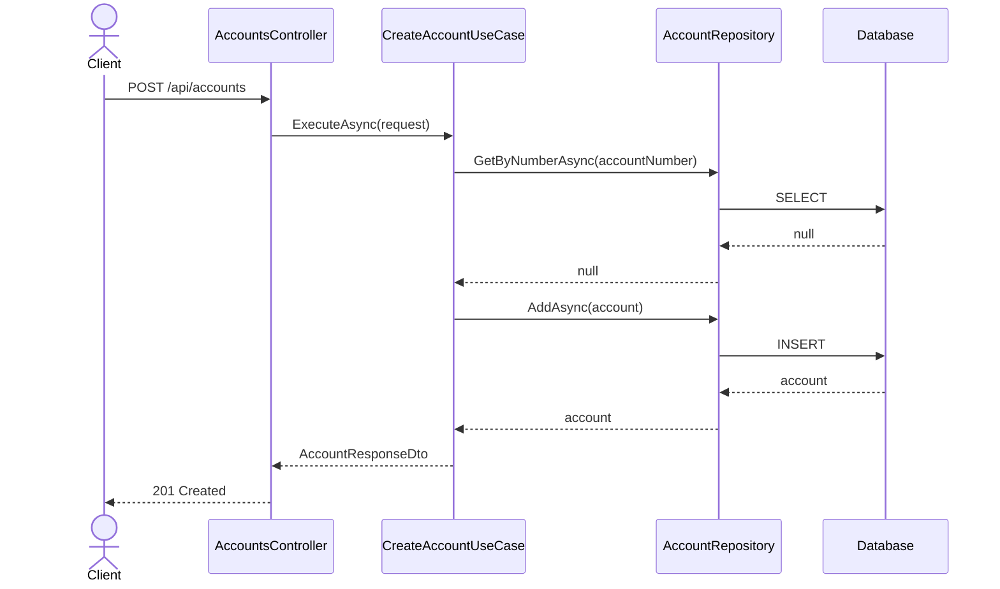
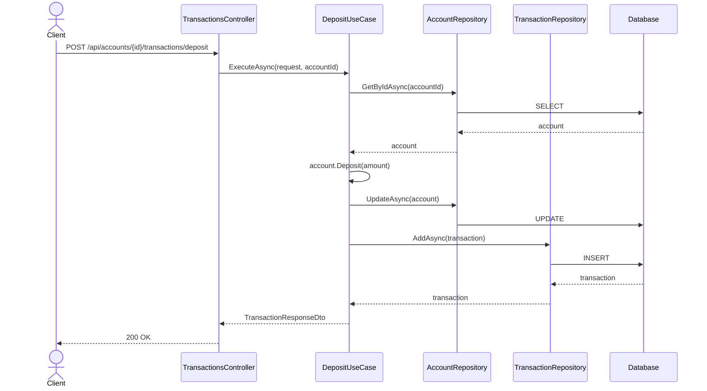
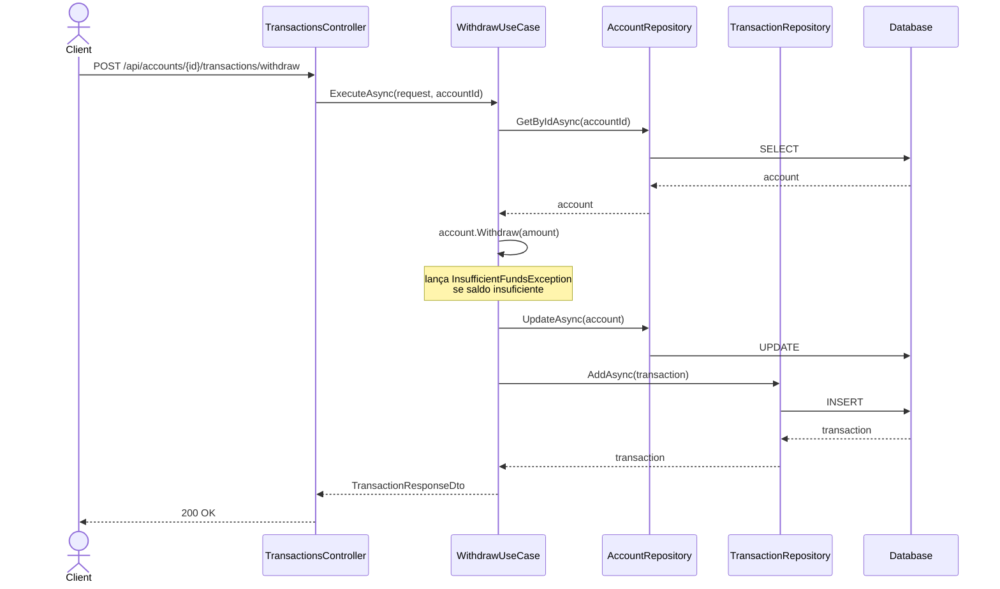
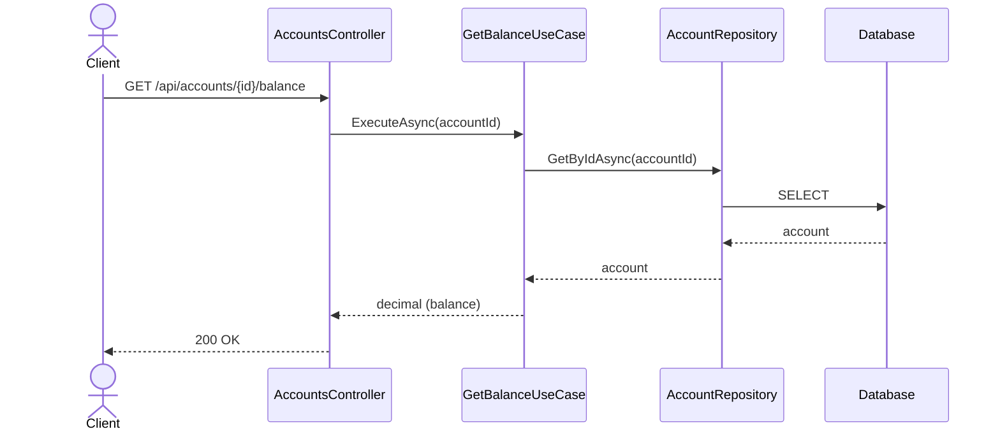
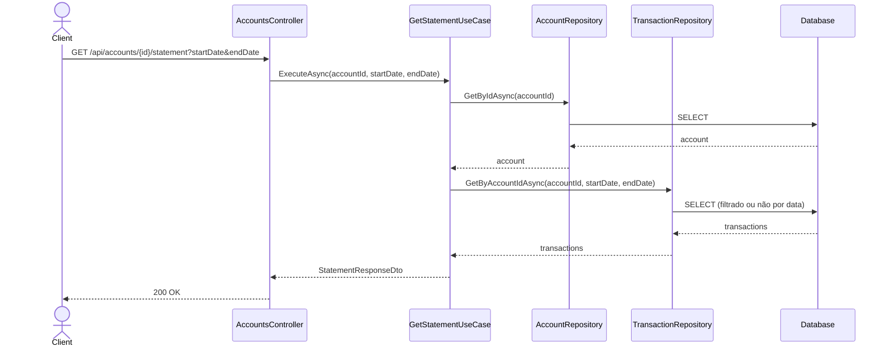

# BankCrudtask

API RESTful bancária para gerenciamento de contas e transações financeiras, construída com .NET 10 seguindo arquitetura hexagonal.

## Tecnologias

- .NET 10 / ASP.NET Core
- Entity Framework Core + SQLite
- xUnit + Moq (testes unitários)
- Swagger / OpenAPI

## Arquitetura

O projeto segue o padrão de **Arquitetura Hexagonal (Ports & Adapters)**, separado em quatro camadas:

```
TaskCrudBanco.Domain          # Entidades, Enums, value objects, ports (repositórios) e exceções de domínio
TaskCrudBanco.Application     # Use cases e DTOs
TaskCrudBanco.Infrastructure  # Repositórios (SQLite), DbContext e migrations
TaskCrudBanco.Api             # Controllers, configuração de injeções de dependências e startup
TaskCrudBanco.Tests           # Testes unitários dos use cases e domínio
```

## Pré-requisitos

- [.NET 10 SDK](https://dotnet.microsoft.com/download)

## Como rodar

```bash
# 1, Clonar o repositório
git clone <url-do-repositorio>
cd BankCrudtask

# 2. Executar a API (as migrations pendentes são aplicadas no startup)
dotnet run --project TaskCrudBanco.Api
```

> Para criar novas migrations após alterar entidades:
> ```bash
> dotnet ef migrations add <NomeDaMigration> --project TaskCrudBanco.Infrastructure --startup-project TaskCrudBanco.Api
> ```

A API estará disponível em `http://localhost:5000`.
Swagger UI: `http://localhost:5000/swagger`

## Endpoints

### Contas

| Método | Rota                              | Descrição                                 |
|--------|-----------------------------------|-------------------------------------------|
| POST   | `/api/accounts`                   | Criar nova conta                          |
| GET    | `/api/accounts/{id}/balance`      | Consultar saldo                           |
| GET    | `/api/accounts/{id}/statement`    | Extrato (filtros: `startDate`, `endDate`) |

### Transações

| Método | Rota                                          | Descrição |
|--------|-----------------------------------------------|-----------|
| POST   | `/api/accounts/{id}/transactions/deposit`     | Depósito  |
| POST   | `/api/accounts/{id}/transactions/withdraw`    | Saque     |

## Diagramas de Sequência

### Criar Conta



### Depósito



### Saque



### Consultar Saldo



### Extrato



## Testes

```bash
dotnet test
```

Os testes cobrem use cases da camada de aplicação e regras de domínio (`Account`, `Money`), utilizando mocks com Moq.
